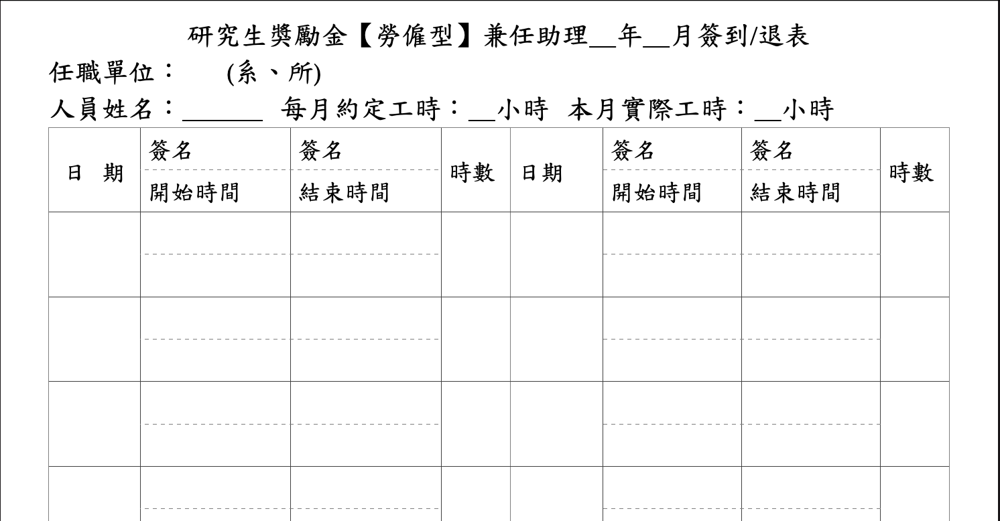

# **NTU Clock in/out Form Filler**
Filling out the clock in/out form automatically for graduate assistants in NTU (National Taiwan University)




## **Documentation**

### 1. Import the package and instantiate `ClockInOutForm` class.

``` python
from clockinoutform import ClockInOutForm

form = ClockInOutForm()
```

### 2. Fill in the header: 
* `year`: the year you've been working in
* `month`: the year you've been working in
* `department`: the department you are in
* `name`: your name
* `expected`: expected hours from the contract
* `actual`: actual hours you've worked for


```python
form.fill_header(
    year=2021, 
    month=7, 
    department="linguistics", 
    name="rayologist", 
    expected=40, 
    actual=40,
)
```

### 3. Fill out the table:

> Date will be generated based on **business days** of the month.

* `year`: As above, for generating bussiness days
* `month`: As above, for generating bussiness days
* `start_time`: which hour you have started 
* `work_hours`: how many hours you've been working
* `work_day`: how many days you've worked
* `signature`: file path of your *electronic signature*


```python
form.fill_table(
    year=2021, 
    month=7, 
    start_time="14:00", 
    work_hours=2, 
    work_day=20, 
    signature_path="signature.png",
)

```

### 4. Save the docx file

* `docx_path`: specify your file path and file name
* `open_`: open the file, default=```False```

```python
form.save(
    docx_path="your file path", 
    open_=True,
)
```
---

## **Tidbit: Generating forms for a period of months**

```python
from clockinoutform import ClockInOutForm


year = 2021
start_month = 1
end_month = 8

for month in range(start_month, end_month + 1):
    form = ClockInOutForm()
    form.fill_header(
        year=year, 
        month=month, 
        department="linguistics", 
        name="rayologist", 
        expected=40, 
        actual=40
    )
    form.fill_table(
        year=year, 
        month=month, 
        start_time="14:00", 
        work_hours=2, 
        work_day=20, 
        signature_path="signature.png",
    )

    form.save(
        docx_path=f"your-file-path/form-{month}", 
        open_=True,
    )


```


## Contact Me
If you have any suggestion or question, please do not hesitate to email me at rayologist1002@gmail.com